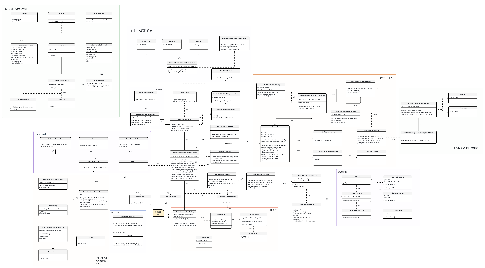

# LX-Mini-Spring
 LX-Mini-Spring 是轻量级的 Spring 框架，实现了 Spring 的核心功能，例如：IOC、DI、AOP、Bean生命周期、上下文、作用域、资源处理、等内容，该项目用于深入理解框架、学习 Spring 中的设计模式，项目附有核心类图，并进行了全代码注释。
## 核心类图

## 参考资料
本仓库代码参考<a>https://github.com/fuzhengwei/small-spring/tree/main 编写，只使用JDK进行实例化和动态代理。
